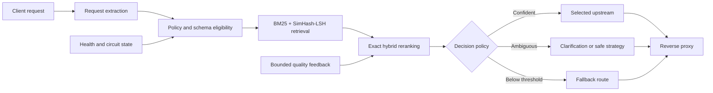

<div align="center">

# HybridRoute

**Policy-aware semantic routing for APIs, services, workflows, and AI endpoints.**

[](https://github.com/vtavakkoli/HybridRoute/actions/workflows/ci.yml)
[](CHANGELOG.md)
[](rust-toolchain.toml)
[](LICENSE)

HybridRoute is a high-performance, gateway-independent semantic API router written in Rust. It selects the most appropriate **API route or upstream service** from natural-language and structured requests by combining policy constraints, lexical retrieval, approximate nearest-neighbour search, embeddings, request metadata, schema compatibility, route health, and bounded quality signals.

[Quick start](#quick-start) · [How it works](#how-it-works) · [Configuration](docs/CONFIGURATION.md) · [Architecture](docs/ARCHITECTURE.md) · [Security](SECURITY.md)

</div>

> [!IMPORTANT]
> HybridRoute is an early-stage research and engineering project. Review its configuration, authentication boundaries, routing policies, and operational controls before production deployment.

## Why HybridRoute?

Traditional API gateways route requests primarily by host, path, method, and headers. That works well when callers already know the correct endpoint. HybridRoute adds a semantic decision layer for cases where a request describes an intent rather than naming a route directly.

Examples include:

- sending a citizen request to the correct municipal service;
- selecting an internal workflow from a support message;
- dispatching documents to specialized processing APIs;
- routing agent actions to policy-eligible tools;
- choosing an AI endpoint as one possible API route, rather than treating model selection as the entire routing problem.

HybridRoute can run as a decision service or as a reverse proxy that forwards the original request to the selected upstream.

## Highlights

| Area | Capability |
|---|---|
| Retrieval | BM25 lexical retrieval plus deterministic SimHash-LSH approximate nearest-neighbour search |
| Reranking | Exact cosine similarity combined with metadata, JSON Schema, and operational quality signals |
| Policy | Method, content type, domain, role, forbidden-role, and required-header filtering |
| Safety | High-impact route restrictions, clarification, deterministic fallback, and bounded exploration |
| Reliability | Active health probes and per-route closed/open/half-open circuit state |
| Runtime | Immutable generation-versioned route tables with atomic `ArcSwap` hot reload |
| Embeddings | Disabled, deterministic hashing, OpenAI-compatible remote endpoint, or optional local FastEmbed |
| Observability | OpenMetrics, structured tracing, request IDs, decision headers, and optional OTLP export |
| Evaluation | Docker Compose demo, deterministic smoke tests, and a generated 1,000-scenario benchmark report |

## How it works



The routing score is a normalized weighted combination of available signals:

```text
score = weighted_mean(
  embedding_similarity,
  lexical_relevance,
  metadata_match,
  schema_compatibility,
  operational_quality
)
```

Selection is intentionally ordered:

1. Extract routing text and structured request context.
2. Apply method, content type, role, header, domain, schema, health, and circuit constraints.
3. Retrieve a small candidate set using BM25 and SimHash-LSH.
4. Rerank candidates using exact semantic and structured signals.
5. Select confidently, request clarification, apply an explicitly allowed safe strategy, or use the fallback route.
6. Proxy the request and record operational success or failure.

See [Architecture](docs/ARCHITECTURE.md) for the component and request-lifecycle details.

## Quick start

### Requirements

- Docker with Docker Compose v2; or
- Rust 1.97.1 for local development.

### Start the demo stack

The command below starts HybridRoute and its required mock upstream APIs, but not the benchmark service:

```bash

docker compose up --build --detach hybridroute
```

Check readiness:

```bash
curl --fail http://localhost:8080/readyz
```

Stop the stack:

```bash
docker compose down --volumes --remove-orphans
```

> [!WARNING]
> The Compose file uses `benchmark-secret` as a demonstration administration token. Replace it before using the stack outside local development.

## Use HybridRoute

### 1. Request a decision without proxying

`POST /v1/route` returns the selected route, score components, decision mode, margin, generation, and visible candidates.

```bash
curl --silent http://localhost:8080/v1/route \
  --header 'Content-Type: application/json' \
  --data '{
    "text": "The streetlight outside my home is broken",
    "method": "POST",
    "content_type": "application/json",
    "domain": "infrastructure",
    "roles": ["citizen"],
    "body": {
      "query": "The streetlight outside my home is broken"
    },
    "sticky_key": "example-001",
    "top_k": 5
  }'
```

A successful response includes a structure similar to:

```json
{
  "selected": {
    "route_id": "streetlight-report",
    "target": "http://streetlight-api:8080",
    "score": 0.91,
    "healthy": true,
    "circuit_state": "closed"
  },
  "mode": "confident",
  "confidence": 0.91,
  "margin": 0.24,
  "generation": 1,
  "candidates": []
}
```

The numeric values above are illustrative; actual values depend on configuration and request context.

### 2. Route and proxy the original request

Any path not reserved by the management API is processed by the semantic proxy.

```bash
curl --include http://localhost:8080/route \
  --header 'Content-Type: application/json' \
  --header 'X-User-Roles: citizen' \
  --header 'X-Service-Domain: utilities' \
  --header 'X-Conversation-ID: example-002' \
  --data '{"query":"A water pipe is leaking under the street"}'
```

When decision headers are enabled, the response includes:

```text
x-hybridroute-route: water-leak
x-hybridroute-score: ...
x-hybridroute-generation: ...
```

Routing text can be supplied through the configured semantic-query header, JSON pointers such as `/query` and `/message`, or a UTF-8 text body.

## Route configuration

Routes are declared in TOML. Each route combines operational targeting with semantic and policy metadata.

```toml
[[routes]]
id = "water-leak"
target = "http://water-api:8080"
rewrite_path = "/handle"
description = "Report leaking pipes, water mains, flooding, or loss of water supply"
examples = [
  "A water pipe is leaking",
  "Report a burst water main"
]
methods = ["POST"]
content_types = ["application/json"]
domains = ["utilities"]
required_roles = ["citizen"]
quality = 0.90
health_path = "/healthz"

[routes.keywords]
water = 1.5
leak = 2.0
pipe = 1.2
flooding = 1.2
```

High-impact routes should explicitly disable exploration and adaptation:

```toml
high_impact = true
safe_for_exploration = false
allow_adaptation = false
```

The complete reference is in [Configuration](docs/CONFIGURATION.md), and the runnable example is in [`config/hybridroute.toml`](config/hybridroute.toml).

## Decision modes

| Mode | Meaning |
|---|---|
| `confident` | The best candidate exceeds the confidence and margin thresholds |
| `top_score` | The highest score is selected without probabilistic exploration |
| `softmax` | Sticky deterministic sampling among explicitly safe, non-high-impact candidates |
| `clarification` | The request is too ambiguous and should be clarified before routing |
| `fallback` | No eligible candidate exceeds the minimum score, or fallback is required by policy |
| `no_match` | No eligible route and no configured fallback are available |

`softmax` is never a mechanism for bypassing policy. Candidates are filtered for authorization, safety, schema, health, and route-level exploration permission before that strategy can run.

## Embedding backends

| Mode | Description |
|---|---|
| `hashing` | Default deterministic local hashing embeddings; no external service required |
| `disabled` | Lexical and structured routing only |
| `remote_openai` | Calls an OpenAI-compatible embeddings endpoint with optional bearer authentication |
| `local_fastembed` | Local `AllMiniLML6V2` embeddings; requires the `local-embeddings` Cargo feature |

Remote embedding calls are cached by request-text hash. Route embeddings are built as part of each immutable route-table generation.

## Safety model

HybridRoute enforces the following invariants in configuration and selection logic:

- policy-ineligible routes are removed before semantic ranking;
- high-impact routes cannot enable probabilistic exploration;
- high-impact routes cannot enable online quality adaptation;
- fallback routes cannot adapt;
- only one fallback route may be configured;
- invalid configuration reloads are rejected before publication;
- in-flight requests continue using their existing immutable generation snapshot;
- unhealthy or circuit-ineligible routes are excluded unless they are the fallback;
- ambiguity can return a structured clarification response instead of guessing.

Authentication must happen before trusting role, tenant, identity, or other security-sensitive headers. See [Security Policy](SECURITY.md) for deployment guidance and vulnerability reporting.

## Runtime API

| Endpoint | Purpose |
|---|---|
| `POST /v1/route` | Return a route decision without forwarding the request |
| `GET /v1/routes` | Return the active route registry |
| `GET /v1/status` | Return generation, health, circuit, and quality state |
| `POST /v1/admin/reload` | Validate, rebuild, and atomically publish configuration |
| `POST /v1/feedback` | Submit bounded route-quality feedback |
| `GET /metrics` | Expose OpenMetrics metrics |
| `GET /healthz` | Liveness endpoint |
| `GET /readyz` | Readiness endpoint |

Administrative endpoints require `X-HybridRoute-Admin-Token`. The token is compared in constant time against the environment variable named by `adaptation.feedback_token_env`.

## Hot reload and operational state

HybridRoute watches the configured TOML file. A change is parsed, validated, embedded, indexed, and assembled into a new immutable route table. Only a successful build is published through a single atomic swap.

Health, circuit, and bounded quality state are maintained separately from the route table, so a configuration reload does not discard live operational state.

## Online quality adaptation

Optional feedback applies a bounded exponential update:

```text
step = clamp(learning_rate × (target_reward - quality), -max_step, +max_step)
quality = clamp(quality + step, min_quality, max_quality)
```

Updates require a valid administration token, a finite reward in `[-1, 1]`, the configured minimum sample count, and route-level permission. High-impact and fallback routes are rejected.

## Observability

HybridRoute provides:

- OpenMetrics counters and routing-latency histograms;
- structured tracing spans and request IDs;
- optional JSON logs;
- decision metadata in proxy response headers;
- optional OTLP export through the `otel` Cargo feature;
- status endpoints for route generation, health, circuit, and quality state.

## Testing and benchmark

Run the deterministic smoke test:

```bash
docker compose up --build --detach hybridroute
bash scripts/smoke-test.sh
docker compose down --volumes --remove-orphans
```

Run the 1,000-scenario benchmark and preserve the benchmark container's exit code:

```bash
docker compose up --build --abort-on-container-exit --exit-code-from test test
```

The benchmark covers 10 API intents, 10 curated phrases per intent, and 10 request contexts per phrase. It generates measured artifacts in `results/`:

- `benchmark-report.html`
- `benchmark-summary.json`
- `scenario-results.jsonl`
- `scenarios.jsonl`

The committed summary is a preflight description until the benchmark service is executed; the project does not claim measured accuracy or latency from that placeholder file.

## Local development

```bash
cargo fmt --all -- --check
cargo clippy --all-targets -- -D warnings
cargo test --all-targets
cargo build --release
```

Run the server directly:

```bash
HYBRIDROUTE_CONFIG=config/hybridroute.toml \
HYBRIDROUTE_FEEDBACK_TOKEN=change-me \
RUST_LOG=hybridroute=info,tower_http=warn \
cargo run --release
```

Optional features:

```bash
cargo build --release --features local-embeddings
cargo build --release --features otel
```

## Project structure

```text
.
├── benchmarks/          # Deterministic benchmark generator and HTML report
├── config/              # Runnable TOML configuration
├── docs/                # Architecture and configuration reference
├── examples/mock-api/   # Lightweight mock upstream used by Compose
├── results/             # Generated benchmark artifacts and preflight summary
├── scripts/             # End-to-end smoke test
├── src/                 # Router, proxy, retrieval, runtime, and telemetry code
├── docker-compose.yml   # Demo topology and benchmark service
└── Dockerfile           # Multi-stage production-style image build
```

## Documentation

- [Architecture](docs/ARCHITECTURE.md)
- [Configuration reference](docs/CONFIGURATION.md)
- [Security policy](SECURITY.md)
- [Contributing guide](CONTRIBUTING.md)
- [Changelog](CHANGELOG.md)
- [Code of Conduct](CODE_OF_CONDUCT.md)

## Contributing

Contributions are welcome. Please read [CONTRIBUTING.md](CONTRIBUTING.md), follow the [Code of Conduct](CODE_OF_CONDUCT.md), and open an issue before proposing a large architectural change.

Security vulnerabilities must not be reported in public issues. Follow [SECURITY.md](SECURITY.md).

## Project status

Version `0.2.0` provides the complete hybrid-routing pipeline, operational controls, Docker demonstration, and evaluation harness described above. The API and configuration format may still evolve before a stable `1.0` release.

## License

HybridRoute is available under the [MIT License](LICENSE).
