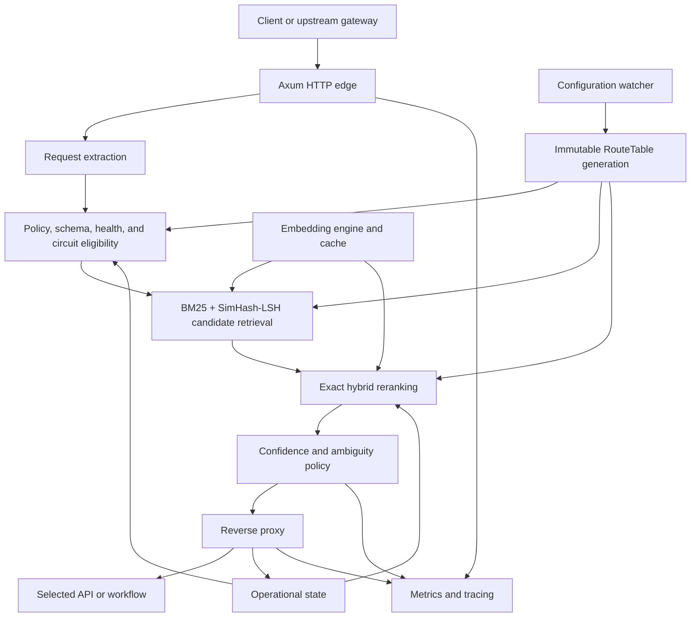
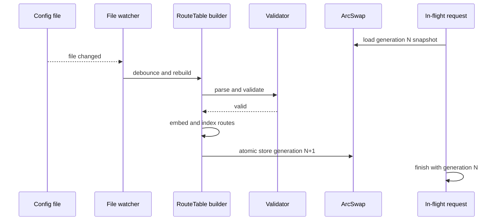

# Architecture

HybridRoute separates semantic route selection from operational proxying while sharing a single immutable runtime view. The design keeps request processing deterministic by default, allows controlled ambiguity handling, and avoids rebuilding shared state on every request.

## System overview



## Main components

| Component | Responsibility |
|---|---|
| `proxy` | HTTP extraction, management endpoints, reverse proxying, and response propagation |
| `router` | Eligibility checks, scoring, ranking, and decision-mode selection |
| `retrieval` | BM25 index and deterministic SimHash-LSH candidate lookup |
| `embedding` | Disabled, hashing, remote OpenAI-compatible, or optional local embedding backend |
| `runtime` | Route-table construction, atomic publication, and file watching |
| `operations` | Health, circuit-breaker, and bounded quality state |
| `schema` | Supported JSON Schema subset compatibility |
| `telemetry` | OpenMetrics instruments and tracing integration |
| `config` | TOML deserialization, defaults, and safety validation |

## Request lifecycle

### 1. Request extraction

HybridRoute supports two entry modes:

- **decision API** — `POST /v1/route` accepts an explicit structured routing request;
- **semantic proxy** — any unreserved path extracts text and context from headers and the original body.

Proxy extraction uses the configured semantic-query header first, then JSON pointers, then UTF-8 text bodies. Roles, domains, and the sticky key are read from configured headers.

### 2. Policy and operational eligibility

Before ranking, a route may be excluded by:

- HTTP method;
- content type;
- required or forbidden roles;
- required header values;
- required schema compatibility;
- health state;
- open or otherwise ineligible circuit state.

The fallback route is handled separately and cannot compete as a normal ranked candidate.

### 3. Candidate retrieval

Candidate generation is intentionally two-stage:

1. **BM25** retrieves routes with strong lexical overlap across descriptions, examples, and keywords.
2. **SimHash-LSH** retrieves approximate neighbours from route semantic documents.

The result sets are unioned and deduplicated. This reduces the number of exact comparisons as route registries grow while preserving both lexical and semantic recall paths.

### 4. Exact hybrid reranking

Each eligible candidate receives signal values for:

- exact cosine similarity;
- BM25 or weighted-keyword relevance;
- metadata match;
- schema compatibility;
- operational quality.

The final score is a normalized weighted mean over available signals:

```text
numerator = Σ(weight_i × signal_i)
score = clamp(numerator / Σ available_weight_i, 0, 1)
```

When embeddings are disabled, the embedding weight is omitted from both numerator and denominator.

### 5. Decision policy

The ranked candidate list is interpreted using score and margin thresholds:

- below `minimum_score` → fallback or no match;
- above `confident_score` with a clear margin → confident selection;
- close top candidates → clarification or the configured ambiguity strategy;
- otherwise → deterministic top-score selection.

High-impact ambiguity always prefers clarification. Sticky softmax is restricted to candidates explicitly marked safe for exploration and never includes high-impact routes.

### 6. Proxy and feedback

For proxied requests, HybridRoute:

1. builds the selected upstream URL;
2. removes hop-by-hop and internal headers;
3. forwards the original method and body;
4. records upstream success or server failure;
5. updates circuit state;
6. optionally adds decision headers to the response.

## Immutable route tables

`RuntimeManager` owns an `ArcSwap<RouteTable>`. A route table contains:

- validated configuration;
- generation number;
- compiled route metadata;
- route embeddings;
- BM25 and SimHash-LSH indexes;
- shared embedding engine;
- observability handles.

Each request acquires one snapshot and uses it for its complete routing operation. A reload cannot create a partially mixed request where extraction, scoring, and route definitions come from different generations.

## Hot reload



Invalid reloads are logged and rejected. The active route table remains unchanged.

## Operational state

Health, circuit, and bounded quality state are stored separately from immutable configuration. This has two effects:

- hot reload does not erase live route health or quality information;
- frequently changing operational values do not require rebuilding the route table.

Circuit states are exposed as `closed`, `open`, and `half_open`. Active probes and proxied responses both contribute to state transitions.

## Embedding architecture

The embedding engine is selected once per route-table generation:

- `disabled` returns no embedding signal;
- `hashing` generates deterministic local normalized vectors;
- `remote_openai` calls an OpenAI-compatible endpoint;
- `local_fastembed` uses local `AllMiniLML6V2` when compiled with the optional feature.

Request embeddings are cached using a BLAKE3 hash of the text. Route embeddings are precomputed during table construction.

## Safety boundaries

HybridRoute is a routing component, not an authentication authority. It assumes trusted infrastructure has already established identity and populated security-sensitive headers.

Core enforced invariants include:

- policy filtering precedes semantic ranking;
- probabilistic selection cannot restore an ineligible route;
- high-impact routes cannot enable exploration or adaptation;
- fallback routes cannot adapt;
- only one fallback route may exist;
- invalid configuration cannot replace the active generation;
- ambiguity may return an explicit clarification result instead of silently guessing.

See [`SECURITY.md`](../SECURITY.md) for deployment guidance.

## Scaling characteristics

The request path is designed to avoid an exhaustive semantic comparison across every registered route:

```text
all routes
  -> policy and operational eligibility
  -> BM25 / SimHash-LSH shortlist
  -> exact hybrid scoring
  -> one decision
```

Actual throughput and latency depend on the number of routes, embedding backend, body size, upstream behavior, and deployment environment. The repository therefore ships a reproducible benchmark harness rather than a fixed performance claim.

## Failure behavior

| Failure | Behavior |
|---|---|
| Invalid TOML or unsafe configuration | Reject reload; retain active generation |
| Embedding backend error | Return an internal routing error for the affected request |
| No eligible candidate over threshold | Use fallback when configured; otherwise no match |
| Ambiguous high-impact candidates | Return clarification |
| Upstream connection or timeout failure | Return bad gateway and record route failure |
| Upstream 5xx | Forward response and record route failure |
| Open circuit | Exclude route from normal eligibility |

## Observability flow

Each request can be correlated through generated or propagated request IDs. The system records decision counts, fallback and clarification counts, routing latency, upstream failures, route status, and tracing spans. Optional OTLP export is available behind the `otel` feature.
